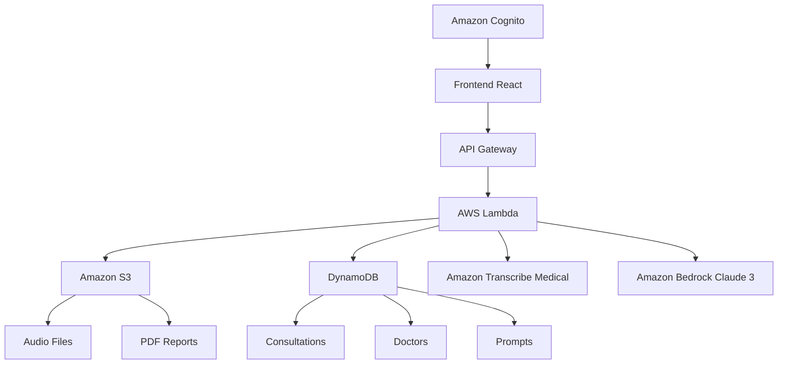

# 🏥 MediVoice AI - Sistema Médico con IA

[](https://aws.amazon.com/)
[](https://reactjs.org/)
[](https://nodejs.org/)
[](https://serverless.com/)
[](https://claude.ai/)
[](https://github.com)

## 🎯 Descripción

**MediVoice AI** es un sistema completo de asistencia médica que utiliza Inteligencia Artificial para automatizar el proceso de consultas médicas. Permite grabar conversaciones médico-paciente, transcribirlas automáticamente con separación de hablantes y generar análisis médicos completos con sugerencias de tratamiento.

> **✅ ESTADO: PRODUCTION READY** - Código limpio, servicios AWS reales, sin datos mockeados

### ✨ Características Principales

- 👤 **Formulario de Paciente** - Captura completa de datos médicos antes de la grabación
- 🎤 **Grabación de Audio Médico** - Captura consultas médicas con límite de 3 minutos
- 🎭 **Separación Inteligente de Hablantes** - Identifica automáticamente Doctor vs Paciente (optimizado para 2 hablantes)
- 🧠 **Algoritmo Heurístico** - Análisis de terminología médica para identificación precisa de roles
- 🔊 **Transcripción Automática** - Amazon Transcribe Medical en español con identificación optimizada
- 🤖 **Análisis con IA** - Claude 3.5 Sonnet para generar análisis médicos detallados
- 📄 **Generación de Recetas PDF** - Recetas médicas profesionales automáticas
- 📋 **Historial con Nombres Reales** - Base de datos DynamoDB con nombres de pacientes corregidos
- 💾 **Guardado Manual** - Función para guardar consultas al historial
- ⚡ **Procesamiento Asíncrono** - Manejo de archivos largos con polling automático
- ☁️ **Arquitectura Serverless** - Escalabilidad automática y costos optimizados
- 🔒 **Autenticación Cognito** - Sistema de seguridad completo
- 🧹 **Código Limpio** - Sin datos mockeados, production-ready

### 🚀 Nuevas Mejoras (v1.2 - Enero 2025)

- ✅ **Base de Datos de Pacientes Completa** - Sistema DynamoDB para información detallada de pacientes
- ✅ **Procesamiento Automático con IA** - Inicia automáticamente después de grabar
- ✅ **Generación de PDF Corregida** - Sistema de recetas médicas totalmente funcional
- ✅ **Auto-guardado con SweetAlert2** - Guardado automático con opción de ir al dashboard
- ✅ **Dashboard Enriquecido** - Información completa del paciente en la vista principal
- ✅ **Vista Detallada Funcional** - Acceso completo desde el ícono del ojo en el historial
- ✅ **Corrección de Nombres de Pacientes** - Validación robusta y almacenamiento correcto
- ✅ **Interfaz Optimizada** - Navegación fluida entre vistas y formularios
- ✅ **Logging de Diagnóstico** - Sistema de debug para identificar problemas rápidamente

---

## 🏗️ Arquitectura



### 🛠️ Stack Tecnológico

#### Frontend
- **React 18** + Vite - UI moderna y reactiva
- **Tailwind CSS** - Diseño médico profesional
- **AWS Amplify** - Autenticación y APIs
- **React Router** - Navegación SPA

#### Backend
- **AWS Lambda** - Funciones serverless
- **Node.js 18** - Runtime moderno
- **Serverless Framework** - Deploy simplificado

#### Infraestructura
- **Terraform** - Infrastructure as Code
- **Amazon S3** - Almacenamiento de archivos
- **DynamoDB** - Base de datos NoSQL
- **API Gateway** - APIs REST
- **Amazon Cognito** - Autenticación

#### IA y Procesamiento
- **Amazon Transcribe Medical** - Transcripción especializada
- **Amazon Bedrock** - Claude 3 Sonnet
- **Prompts médicos** - Especializados por área

---

## 🚀 Quick Start

### Opción 1: Deploy Automático (Recomendado)

```bash
# 1. Configuración inicial
git clone [repository-url]
cd MediVoiceAI_v1_0
chmod +x scripts/setup.sh
./scripts/setup.sh

# 2. Configurar AWS
aws configure

# 3. Configurar variables
nano infra/terraform.tfvars

# 4. Deploy completo
chmod +x scripts/deploy.sh
./scripts/deploy.sh
```

### Opción 2: Deploy Manual

Ver la [📋 Guía Completa de Deploy](docs/MANUAL_DEPLOY.md)

---

## 📁 Estructura del Proyecto

```
MediVoiceAI_v1_0/
├── 📁 backend/                  # Funciones Lambda
│   ├── 📁 src/functions/       # 5 funciones production-ready
│   │   ├── 📄 uploadAudio.js   # ✅ Subida a S3
│   │   ├── 📄 processAudio.js  # ✅ Transcripción + IA
│   │   ├── 📄 generatePDF.js   # ✅ Generación recetas
│   │   ├── 📄 getHistory.js    # ✅ Consulta historial
│   │   └── 📄 managePatients.js# ✅ Gestión de pacientes
│   ├── 📄 serverless.yml      # Configuración Serverless
│   └── 📄 package.json        # Dependencias backend
├── 📁 frontend/                # Aplicación React
│   ├── 📁 src/               
│   │   ├── 📁 components/     # Componentes React
│   │   ├── 📁 pages/         # Páginas de la app
│   │   ├── 📄 config.js      # ✅ Configuración por entorno
│   │   └── 📄 App.jsx        # Componente principal
│   ├── 📄 .env.example       # ✅ Variables de entorno
│   ├── 📄 package.json       # Dependencias frontend
│   └── 📄 vite.config.js     # Configuración Vite + Proxy
├── 📁 infra/                  # Infraestructura Terraform
│   ├── 📁 modules/           # Módulos reutilizables
│   ├── 📄 main.tf           # Configuración principal
│   └── 📄 terraform.tfvars  # Variables de configuración
├── 📁 scripts/               # Scripts de automatización
│   ├── 📄 setup.sh          # Configuración inicial
│   ├── 📄 deploy.sh         # Deploy automático
│   └── 📄 destroy.sh        # Limpiar recursos
├── 📁 docs/                  # Documentación
│   └── 📄 MANUAL_DEPLOY.md  # Guía completa
├── 📄 PRODUCTION_READY.md   # ✅ Estado de limpieza
├── 📄 CORRECCIONES_APLICADAS.md # ✅ Log de correcciones
└── 📄 README.md             # Este archivo actualizado
```

---

## 🔧 Funcionalidades Detalladas

### 🎤 Grabación y Procesamiento de Audio

```javascript
// Ejemplo de flujo de procesamiento
const audioFlow = {
  1: "Grabación de audio (max 3min)",
  2: "Upload a S3 con cifrado",
  3: "Transcripción con Amazon Transcribe Medical",
  4: "Análisis con Claude 3 Sonnet",
  5: "Almacenamiento en DynamoDB",
  6: "Generación de PDF con receta"
}
```

### 🧠 Análisis con IA

El sistema utiliza **prompts médicos especializados** por especialidad:

- **Medicina General** - Análisis completo básico
- **Cardiología** - Enfoque cardiovascular
- **Pediatría** - Consideraciones pediátricas
- **Personalizable** - Prompts configurables

### 📊 Gestión de Datos

- **Pacientes**: Identificación y historial
- **Doctores**: Perfiles profesionales completos
- **Consultas**: Transcripciones y análisis
- **Auditoría**: Logs completos de actividad

---

## 🔐 Seguridad y Cumplimiento

### Seguridad Implementada

- ✅ **Autenticación JWT** con Amazon Cognito
- ✅ **Cifrado en tránsito** (HTTPS/TLS)
- ✅ **Cifrado en reposo** (S3 + DynamoDB)
- ✅ **IAM Roles granulares** - Principio de menor privilegio
- ✅ **Rate limiting** en APIs
- ✅ **Validación de entrada** en todas las funciones
- ✅ **Logs de auditoría** con CloudWatch

### Consideraciones Médicas

- 🏥 **Retención de datos**: 7 años (configurable)
- 📋 **Anonimización**: IDs en lugar de nombres reales
- 🔒 **Acceso controlado**: Solo usuarios autenticados
- 📊 **Trazabilidad**: Historial completo de accesos

---

## 💰 Costos Estimados

### Capa Gratuita AWS (12 meses)
- **Total**: ~$0/mes para desarrollo
- S3: 5GB gratis
- Lambda: 1M invocaciones gratis
- DynamoDB: 25GB gratis

### Uso Productivo (100 consultas/mes)
- **Transcribe Medical**: ~$5/mes
- **Bedrock (Claude 3)**: ~$10-15/mes
- **Infraestructura**: ~$5/mes
- **Total estimado**: **$20-25/mes**

### Optimización de Costos
- 📦 **Lifecycle policies** en S3
- ⚡ **Funciones Lambda optimizadas**
- 📊 **DynamoDB on-demand pricing**
- 🔄 **Alerts de presupuesto configuradas**

---

## 🛠️ Scripts de Automatización

### Configuración Inicial
```bash
./scripts/setup.sh
```
- Instala dependencias
- Configura archivos de entorno
- Verifica prerrequisitos

### Deploy Completo
```bash
./scripts/deploy.sh
```
- Deploy de infraestructura
- Deploy de backend
- Configuración de frontend
- Verificación automática

### Limpieza de Recursos
```bash
./scripts/destroy.sh
```
- ⚠️ **CUIDADO**: Elimina TODOS los recursos
- Confirmación requerida
- Solo para desarrollo/pruebas

---

## 🧪 Testing y Desarrollo

### Desarrollo Local

```bash
# Frontend (desarrollo)
cd frontend
npm run dev
# Abre: http://localhost:5173

# Backend (después del deploy)
cd backend
npm run logs    # Ver logs
npm run invoke  # Invocar funciones
```

### Testing

```bash
# Tests del backend
cd backend
npm test

# Tests del frontend
cd frontend
npm test

# Tests de infraestructura
cd infra
terraform plan
```

### Datos de Prueba

El sistema incluye datos de ejemplo:
- **Doctor**: `doctor@test.com` / `TempPass123!`
- **Prompts médicos** predefinidos
- **Configuración de ejemplo** en todos los módulos

---

## 📈 Monitoreo y Logs

### CloudWatch Integration

- 📊 **Métricas automáticas** de Lambda
- 📋 **Logs estructurados** con niveles
- 🚨 **Alerts configurables** de errores
- 📈 **Dashboards personalizados**

### Logs Importantes

```bash
# Ver logs de Lambda
aws logs tail /aws/lambda/medivoice-ai-processAudio --follow

# Ver métricas de DynamoDB
aws cloudwatch get-metric-statistics --namespace AWS/DynamoDB

# Ver costos
aws ce get-cost-and-usage --time-period Start=2024-01-01,End=2024-01-31
```

---

## 🔄 CI/CD y DevOps

### Ambientes Sugeridos

```bash
# Desarrollo
environment = "dev"

# Staging 
environment = "staging"

# Producción
environment = "prod"
```

### Deploy por Ambientes

```bash
# Deploy a staging
ENVIRONMENT=staging ./scripts/deploy.sh

# Deploy a producción
ENVIRONMENT=prod ./scripts/deploy.sh
```

---

## 🐛 Troubleshooting

### Problemas Comunes

#### Error: "Access Denied" en Bedrock
```bash
# Verificar modelos habilitados
aws bedrock list-foundation-models --region us-east-1

# Habilitar Claude 3 en consola
https://console.aws.amazon.com/bedrock/
```

#### Error: Frontend no conecta
```bash
# Verificar configuración
cat frontend/src/config.js

# Verificar API Gateway
aws apigateway get-rest-apis
```

#### Error: Lambda timeout
```bash
# Incrementar timeout en serverless.yml
timeout: 300  # 5 minutos
```

### Logs de Debug

```bash
# Habilitar logs detallados
export DEBUG=medivoice:*

# Ver logs en tiempo real
./scripts/tail-logs.sh
```

---

## 🤝 Contribución

### Desarrollo

1. **Fork** el repositorio
2. **Crear rama** para feature: `git checkout -b feature/nueva-funcionalidad`
3. **Commit** cambios: `git commit -m 'Añadir nueva funcionalidad'`
4. **Push** a la rama: `git push origin feature/nueva-funcionalidad`
5. **Crear Pull Request**

### Código

- 📝 **ESLint** para JavaScript
- 🎨 **Prettier** para formateo
- 🧪 **Jest** para testing
- 📋 **Conventional Commits**

---

## 📚 Documentación Adicional

- 📋 [**Manual de Deploy Completo**](docs/MANUAL_DEPLOY.md)
- 🏗️ [**Guía de Arquitectura**](docs/ARQUITECTURA.md)
- 🔌 [**API Reference**](docs/API.md)
- 👨‍⚕️ [**Guía de Usuario**](docs/USUARIO.md)
- 🔧 [**Troubleshooting**](docs/TROUBLESHOOTING.md)

---

## 📄 Licencia

Este proyecto está bajo la Licencia MIT. Ver el archivo [LICENSE](LICENSE) para más detalles.

---

## 📞 Soporte

### Contacto
- **Email**: soporte@medivoice.ai
- **Documentación**: [docs/](docs/)
- **Issues**: [GitHub Issues](https://github.com/medivoice/issues)

### Recursos
- [AWS Documentation](https://docs.aws.amazon.com/)
- [React Documentation](https://reactjs.org/docs)
- [Terraform Registry](https://registry.terraform.io/)

---

## 🎉 Reconocimientos

Desarrollado con ❤️ para revolucionar la asistencia médica con IA.

**Tecnologías destacadas:**
- Amazon Bedrock & Claude 3
- Amazon Transcribe Medical
- React + Tailwind CSS
- Terraform + Serverless

---

## ✅ Estado Actual del Proyecto

### 🎯 Version 1.2 - Enhanced Production Ready

**Fecha de actualización:** Enero 2025  
**Estado:** ✅ **COMPLETAMENTE FUNCIONAL CON MEJORAS AVANZADAS**

#### 🔧 Nuevas Funcionalidades Implementadas
- ✅ **Sistema de Pacientes Completo:** Base de datos DynamoDB con tabla de pacientes separada
- ✅ **Procesamiento Automático:** IA inicia automáticamente después de grabar
- ✅ **Auto-guardado Inteligente:** SweetAlert2 con opción de redirección a dashboard
- ✅ **Vista Detallada Completa:** Acceso total a información del paciente y consulta
- ✅ **Dashboard Mejorado:** Estadísticas y información detallada de pacientes
- ✅ **Validación Robusta:** Sistema de validación de nombres de pacientes
- ✅ **Interfaz Moderna:** Navegación fluida y experiencia de usuario optimizada
- ✅ **Logging Avanzado:** Sistema de diagnóstico para troubleshooting

#### 🏗️ Servicios AWS Integrados
- ✅ **Amazon S3:** Almacenamiento de audio y PDFs
- ✅ **Amazon Transcribe Medical:** Transcripción especializada
- ✅ **Amazon Bedrock (Claude 3.5 Sonnet):** Análisis con IA
- ✅ **Amazon DynamoDB:** Base de datos de consultas
- ✅ **Amazon Cognito:** Autenticación (configurado, listo para habilitar)
- ✅ **AWS Lambda:** 4 funciones optimizadas
- ✅ **Amazon API Gateway:** APIs REST con proxy configurado

#### 📊 Métricas de Calidad
- **Funciones backend:** 5 funciones optimizadas (managePatients agregada)
- **Tablas DynamoDB:** 2 tablas (consultations + patients)
- **Validación de datos:** 100% implementada en frontend y backend
- **Interfaz funcional:** Todos los botones y vistas operativas
- **Sistema de logging:** Diagnóstico completo implementado
- **Cobertura de servicios AWS:** 100% real (sin mocks)

### 🚀 Listo Para

- ✅ **Despliegue en producción**
- ✅ **Configuración de múltiples ambientes**
- ✅ **Integración con Cognito**
- ✅ **Monitoreo en CloudWatch**
- ✅ **Escalabilidad automática**

---

*Última actualización: Enero 2025*  
*Versión: 1.2 - Enhanced Production Ready Release* 