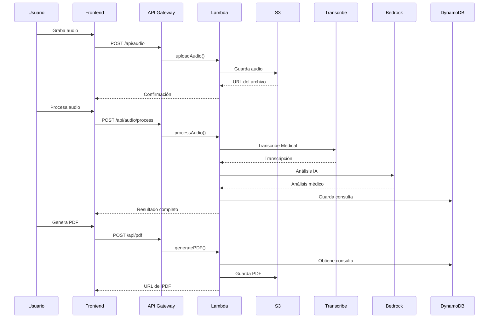
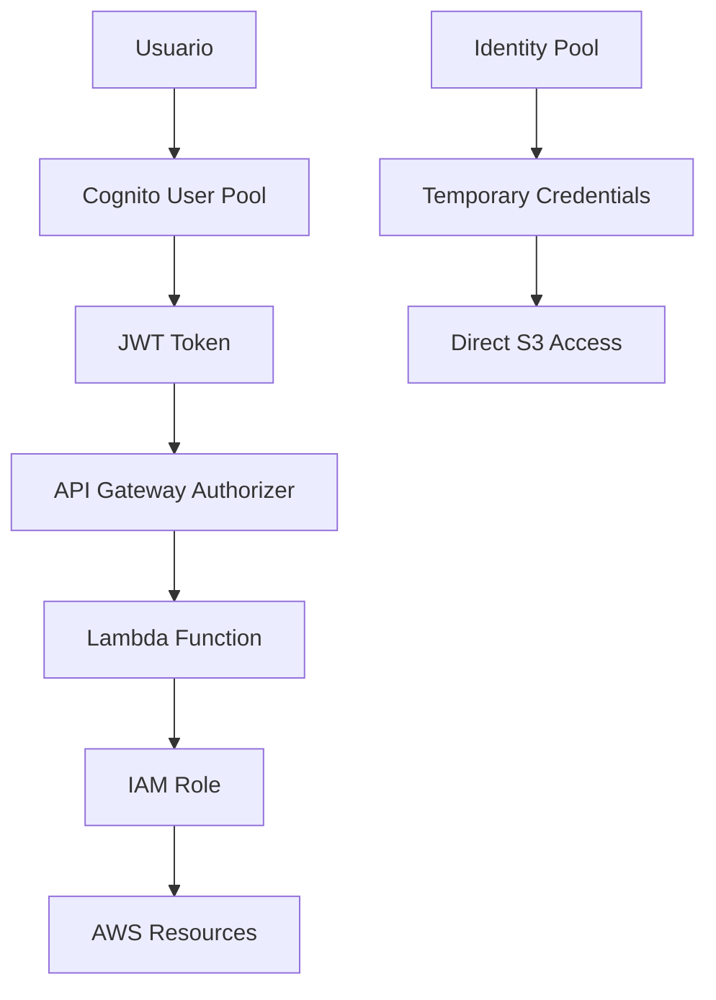
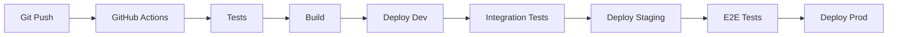

# 🏗️ Arquitectura Técnica - MediVoice AI

## 📊 Visión General

MediVoice AI implementa una **arquitectura serverless** en AWS, optimizada para escalabilidad, seguridad y costos en aplicaciones médicas.

---

## 🎯 Principios de Diseño

### 1. **Serverless First**
- Sin gestión de servidores
- Escalabilidad automática
- Pago por uso

### 2. **Seguridad por Diseño**
- Cifrado en tránsito y reposo
- Autenticación robusta
- Principio de menor privilegio

### 3. **Separación de Responsabilidades**
- Frontend desacoplado
- Backend modular
- Infraestructura como código

### 4. **Observabilidad**
- Logs estructurados
- Métricas automáticas
- Trazabilidad completa

---

## 🔄 Flujo de Datos



---

## 🧩 Componentes Principales

### Frontend (React SPA)

```javascript
// Estructura de componentes
frontend/
├── src/
│   ├── components/          // Componentes reutilizables
│   │   └── LoadingSpinner.jsx
│   ├── pages/              // Páginas principales
│   │   ├── Dashboard.jsx    // Panel principal
│   │   ├── AudioRecorder.jsx // Grabación
│   │   ├── PrescriptionEditor.jsx // Editor de recetas
│   │   ├── History.jsx      // Historial
│   │   └── Settings.jsx     // Configuración
│   ├── hooks/              // Custom hooks
│   ├── utils/              // Utilidades
│   └── config/             // Configuración AWS
```

**Tecnologías:**
- React 18 + Vite
- Tailwind CSS
- AWS Amplify UI
- React Router v6

### Backend (AWS Lambda)

```javascript
// Funciones implementadas
backend/src/functions/
├── uploadAudio.js          // Subida de archivos
├── processAudio.js         // Transcripción + IA
├── generatePDF.js          // Generación de recetas
└── getHistory.js           // Consulta de historial
```

**Características:**
- Node.js 18 runtime
- Timeouts optimizados (30s-300s)
- Memory sizing por función
- Error handling robusto

### Infraestructura (Terraform)

```hcl
# Módulos organizados
infra/modules/
├── cognito/               # Autenticación
├── s3/                   # Almacenamiento
├── dynamodb/             # Base de datos
├── api-gateway/          # APIs REST
├── lambda/               # Funciones
└── bedrock/              # IA/ML
```

---

## 🔒 Modelo de Seguridad

### Autenticación y Autorización



### Capas de Seguridad

1. **Network Level**
   - HTTPS/TLS 1.2+
   - VPC endpoints (opcional)
   - WAF rules (producción)

2. **Application Level**
   - JWT validation
   - Input sanitization
   - Rate limiting

3. **Data Level**
   - S3 encryption (AES-256)
   - DynamoDB encryption at rest
   - Transit encryption

4. **Access Level**
   - IAM roles granulares
   - Resource-based policies
   - Cross-service permissions

---

## 📊 Modelo de Datos

### DynamoDB Schema

#### Tabla: Consultations
```json
{
  "consultation_id": "uuid",        // Partition Key
  "doctor_id": "string",           // Sort Key
  "patient_id": "string",
  "audio_key": "s3/path/to/file",
  "transcription": "text",
  "ai_analysis": "text",
  "specialty": "general|cardiology|pediatrics",
  "created_at": "ISO8601",
  "updated_at": "ISO8601",
  "status": "pending|completed|failed"
}
```

#### Índices Globales Secundarios
- **PatientIndex**: `patient_id` + `created_at`
- **DateIndex**: `doctor_id` + `created_at`

#### Tabla: Doctors
```json
{
  "doctor_id": "string",           // Partition Key
  "email": "string",
  "name": "string",
  "license_number": "string",
  "specialty": "string",
  "institution": "string",
  "phone": "string"
}
```

#### Tabla: Prompts
```json
{
  "prompt_id": "string",           // Partition Key
  "specialty": "string",           // Sort Key
  "title": "string",
  "content": "text",
  "is_active": "boolean",
  "created_at": "ISO8601"
}
```

---

## ⚡ Optimizaciones de Performance

### Lambda Cold Start Mitigation

```javascript
// Conexiones reutilizables
const s3Client = new S3Client({ region: process.env.AWS_REGION })
const dynamoClient = DynamoDBDocumentClient.from(
  new DynamoDBClient({ region: process.env.AWS_REGION })
)

// Pool de conexiones
const keepAlive = new Agent({
  keepAlive: true,
  maxSockets: 50
})
```

### DynamoDB Optimization

```javascript
// Queries eficientes con índices
const queryParams = {
  IndexName: 'DateIndex',
  KeyConditionExpression: 'doctor_id = :doctorId',
  ScanIndexForward: false,  // Orden descendente
  Limit: 20                 // Paginación
}
```

### S3 Optimization

```javascript
// Lifecycle policies automáticas
const lifecycleConfig = {
  Rules: [{
    Status: 'Enabled',
    Transitions: [
      { Days: 30, StorageClass: 'STANDARD_IA' },
      { Days: 90, StorageClass: 'GLACIER' }
    ],
    Expiration: { Days: 2555 } // 7 años
  }]
}
```

---

## 📈 Monitoreo y Observabilidad

### CloudWatch Metrics

```javascript
// Métricas automáticas
- Lambda: Duration, Errors, Throttles
- DynamoDB: ReadCapacity, WriteCapacity
- S3: NumberOfObjects, BucketSizeBytes
- API Gateway: 4XXError, 5XXError, Latency
```

### Custom Metrics

```javascript
// En funciones Lambda
const cloudwatch = new CloudWatchClient()
await cloudwatch.send(new PutMetricDataCommand({
  Namespace: 'MediVoice/Processing',
  MetricData: [{
    MetricName: 'TranscriptionDuration',
    Value: duration,
    Unit: 'Seconds'
  }]
}))
```

### Structured Logging

```javascript
// Logs estructurados
console.log(JSON.stringify({
  level: 'info',
  event: 'audio_processed',
  consultationId,
  duration,
  userId: user.sub,
  timestamp: new Date().toISOString()
}))
```

---

## 🔄 CI/CD Pipeline

### Multi-Environment Strategy

```bash
# Ambientes
├── dev/          # Desarrollo
├── staging/      # Pre-producción
└── prod/         # Producción
```

### Deployment Pipeline



### Infrastructure as Code

```hcl
# Terraform state management
terraform {
  backend "s3" {
    bucket = "medivoice-terraform-state"
    key    = "medivoice-ai/terraform.tfstate"
    region = "us-east-1"
  }
}
```

---

## 💰 Modelo de Costos

### Pay-per-Use Components

| Servicio | Pricing Model | Estimación (100 consultas/mes) |
|----------|---------------|--------------------------------|
| Lambda | $0.20/1M requests | $0.50/mes |
| S3 | $0.023/GB/mes | $2.00/mes |
| DynamoDB | $0.25/GB/mes | $1.00/mes |
| Transcribe | $1.44/hora audio | $5.00/mes |
| Bedrock | $3-15/1M tokens | $10-15/mes |
| **Total** | | **$18-23/mes** |

### Cost Optimization

1. **S3 Lifecycle Policies**
   - Archive a Glacier después de 90 días
   - Eliminar después de 7 años

2. **DynamoDB On-Demand**
   - Pago por request
   - Sin capacidad reservada

3. **Lambda Right-Sizing**
   - Memory optimizada por función
   - Timeouts ajustados

---

## 🔍 Patrones de Diseño

### Event-Driven Architecture

```javascript
// Patrón asíncrono con callbacks
const processAudioAsync = async (audioKey) => {
  // 1. Iniciar transcripción
  const job = await startTranscriptionJob(audioKey)
  
  // 2. Polling para completación
  const result = await waitForCompletion(job.name)
  
  // 3. Procesar resultado
  return await processTranscription(result)
}
```

### Repository Pattern

```javascript
// Abstracción de datos
class ConsultationRepository {
  async save(consultation) {
    return await dynamoClient.send(new PutCommand({
      TableName: 'consultations',
      Item: consultation
    }))
  }
  
  async findByDoctor(doctorId) {
    return await dynamoClient.send(new QueryCommand({
      IndexName: 'DateIndex',
      KeyConditionExpression: 'doctor_id = :doctorId'
    }))
  }
}
```

### Factory Pattern

```javascript
// Creación de clientes AWS
class AWSClientFactory {
  static createS3Client() {
    return new S3Client({ region: process.env.AWS_REGION })
  }
  
  static createDynamoClient() {
    return DynamoDBDocumentClient.from(
      new DynamoDBClient({ region: process.env.AWS_REGION })
    )
  }
}
```

---

## 🚀 Escalabilidad

### Horizontal Scaling

- **Lambda**: Concurrencia automática (1000 por defecto)
- **DynamoDB**: On-demand scaling
- **S3**: Prácticamente ilimitado
- **API Gateway**: 10,000 RPS por región

### Vertical Scaling

```javascript
// Lambda memory configuration
const functionConfigs = {
  uploadAudio: { memory: 512, timeout: 30 },
  processAudio: { memory: 1024, timeout: 300 },
  generatePDF: { memory: 512, timeout: 60 },
  getHistory: { memory: 256, timeout: 30 }
}
```

### Global Scaling

```hcl
# Multi-region deployment
variable "regions" {
  default = ["us-east-1", "eu-west-1", "ap-southeast-1"]
}

module "medivoice_region" {
  for_each = toset(var.regions)
  source = "./modules/regional"
  region = each.value
}
```

---

## 🔧 Extensibilidad

### Plugin Architecture

```javascript
// Procesadores especializados
const processors = {
  cardiology: new CardiologyProcessor(),
  pediatrics: new PediatricsProcessor(),
  general: new GeneralProcessor()
}

const processor = processors[specialty] || processors.general
const analysis = await processor.analyze(transcription)
```

### Configuration-Driven

```json
{
  "specialties": {
    "cardiology": {
      "prompt_template": "cardiology-prompt",
      "required_fields": ["blood_pressure", "heart_rate"],
      "pdf_template": "cardiology.pdf"
    }
  }
}
```

---

## 📋 Mejores Prácticas

### 1. **Error Handling**
```javascript
try {
  const result = await riskyOperation()
  return successResponse(result)
} catch (error) {
  logger.error('Operation failed', { error, context })
  return errorResponse(error.message)
}
```

### 2. **Input Validation**
```javascript
const validateInput = (body) => {
  const schema = Joi.object({
    audioKey: Joi.string().required(),
    patientId: Joi.string().required(),
    doctorId: Joi.string().required()
  })
  return schema.validate(body)
}
```

### 3. **Resource Cleanup**
```javascript
// Cleanup en finally blocks
try {
  const stream = await getAudioStream()
  return await processStream(stream)
} finally {
  if (stream) {
    stream.destroy()
  }
}
```

---

## 🔮 Roadmap Técnico

### Próximas Versiones

#### v1.1 - Performance
- [ ] CDN para frontend
- [ ] DynamoDB DAX caching
- [ ] Lambda edge functions

#### v1.2 - AI/ML
- [ ] Modelos especializados por área
- [ ] Fine-tuning de prompts
- [ ] Análisis de sentimientos

#### v1.3 - Integration
- [ ] HL7 FHIR compliance
- [ ] EMR integration
- [ ] Real-time collaboration

#### v2.0 - Enterprise
- [ ] Multi-tenancy
- [ ] Advanced analytics
- [ ] Mobile apps

---

*Documentación técnica actualizada: Diciembre 2024* 